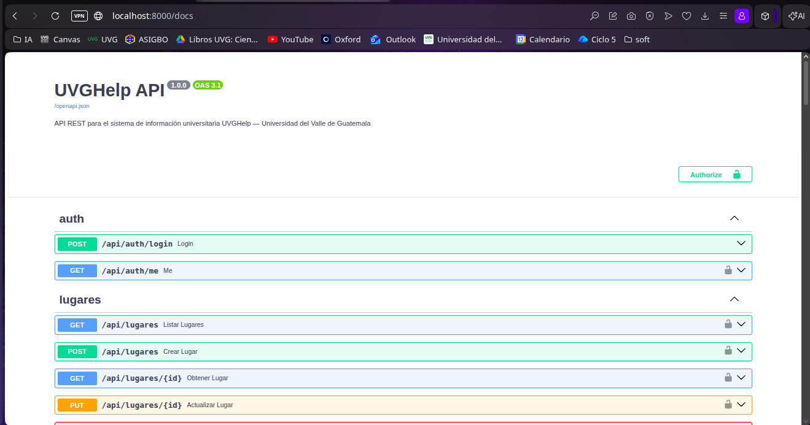
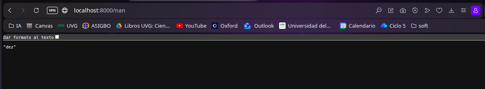

# UVGHelp Backend

## Repositorios

- Frontend: https://github.com/her24770/web-UVGHelp-frontend
- Backend: https://github.com/her24770/web-UVGHelp-backend
- Sitio publicado: https://UVHelp.jhgo.online

API REST para el sistema de información universitaria UVGHelp — Universidad del Valle de Guatemala.

## Stack

- Python 3.11 + FastAPI
- PostgreSQL 15
- SQLAlchemy 2 + Alembic
- Docker + Docker Compose

## Correr el proyecto

### Requisitos
- Docker
- Docker Compose

### Pasos

```bash
# 1. Clonar el repositorio
git clone https://github.com/her24770/web-UVGHelp-backend.git
cd web-UVGHelp-backend

# 2. Copiar variables de entorno y compose
cp .env.example .env
cp docker-compose.example.yml docker-compose.yml

# 3. Levantar todo
docker compose up --build
```

La API estará disponible en:
- API: http://localhost:8000
- Swagger UI: http://localhost:8000/docs
- ReDoc: http://localhost:8000/redoc

## CORS

CORS (Cross-Origin Resource Sharing) es el mecanismo que permite o bloquea peticiones HTTP entre orígenes distintos (diferente dominio o puerto); como el frontend y el backend corren en puertos diferentes, el backend configura `allow_origins=["*"]` para aceptar peticiones de cualquier origen durante desarrollo.

## Challenges implementados

### API y Backend

- **Spec OpenAPI/Swagger** — FastAPI genera automáticamente la especificación OpenAPI completa desde el código, sin configuración adicional
- **Swagger UI** — interfaz interactiva corriendo en `/docs`; permite probar cualquier endpoint directamente desde el navegador
- **Códigos HTTP correctos** — 201 al crear, 204 al eliminar, 404 si no existe el recurso, 400 en input inválido
- **Validación server-side** — Pydantic valida todos los campos de entrada; los errores se devuelven en JSON con detalle por campo: `{ error, code, message, details: [{ field, msg }] }`
- **Paginación** — parámetros `?page=` y `?limit=` disponibles en todos los endpoints de lista
- **Búsqueda** — parámetro `?q=` para búsqueda por nombre en todos los endpoints de lista
- **Ordenamiento** — parámetros `?sort=` y `?order=asc|desc` en todos los endpoints de lista

### Challenges adicionales

- **Upload de imágenes** — endpoint `POST /upload/imagen`; valida tipo MIME y extensión para evitar spoofing, rechaza archivos mayores a 1MB con error 400

## Screenshots




## Reflexión

El backend se construyó con FastAPI por interés propio en la tecnología. Python por sí solo no cubre todos los puntos necesarios para una API robusta, pero el ecosistema de librerías lo resuelve bien: Pydantic para la validación y modelado de respuestas, y SQLAlchemy para una conexión más limpia con la base de datos con menos fricciones en el manejo de relaciones.

Dockerizar el proyecto fue uno de los pasos más importantes. Tener un entorno de desarrollo reproducible con un solo comando elimina el clásico problema de "funciona en mi máquina" y simplifica enormemente el proceso de subir la aplicación a un servidor.

Lo que más sorprendió fue la integración automática de Swagger. Nunca había trabajado con una herramienta que genere documentación interactiva de los endpoints directamente desde el código, sin configuración adicional. Poder probar cualquier endpoint desde `/docs` con los esquemas ya definidos agilizó mucho el desarrollo y la verificación de que la API respondía correctamente.

Volvería a usar FastAPI en proyectos futuros, especialmente en contextos donde Python ya es la elección natural: modelado de datos, integración con herramientas de IA o cálculos matemáticos intensivos. Para APIs puramente web sin esas necesidades, evaluaría otras opciones, pero FastAPI sigue siendo una elección muy buena por su velocidad, su tipado y su documentación automática.
